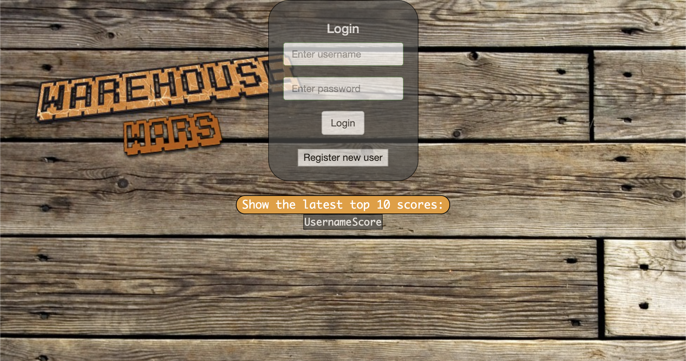

# Warehouse-War-Game
Web based multiplayer game
<hr>

### Overview:

This is an web based multiplayer game with the goal to kill off as many monsters as possible.

- The game front end is mostly comprised of **ReactJs**
- **Bootstrap** and **CSS** is used for beautification
- Backend is comprised of purely **Nodejs** and **RestAPI**
- **Sqlite3** is used for database
- Different algorithms are used to move the monsters, including __Ford-Fulkersein Method__ to find least cost to kill a player and __AI algorithm called A* Search  with heuristics__ to find fastest way to kill multiple players.

### Feature:
- Have a fully functioning login system and allows new players to register
- Allows multiple people to join the same game
- Keep history of scores for each players and displays the top 3 scores
- The game contains lobby where players are allowed to choose their avatars 
- Allows players to message anyone in the lobby of the game
- Contains Monsters that should be kill. Also includes a **smart monster** which uses A\* Search to locate players and try to kill them.

### Installation instructions:
Before installation, make sure you have the following:

- A web browser
- Nodejs installed on the host computers
- sqlite3 is installed on teh host computers.

For installation, follow the steps below:

- Clone the repo
- Go inside `ww` folder (you can do this by `cd Warehouse-War-Game/ww/`)
- Load Database file using `sqlite3 database.sqlite3 < schema.sql`
- Run the game by typing `nodejs ww_node.js` 

### CURL
You can use CURL command to access REST API. For Example:
```sh
>>curl -d '{"username":"pop", "password":"pop"}' -H "Content-Type: application/json" -X POST http://localhost:10820/api/registeredUsers/pop/getData/

{"name":"pop","user_name":"pop","avatar_ID":"coolImg"}
```

### How to play:
The main goal of the game is to kill off monsters together, enforcing team work. When you start the game, you will see the following login screen:


You can register yourself as a player on the registration screen. Once you login, you will be redirected toward a lobby:


Here you can message other people who are present in the lobby. You can also choose your avatar and start the game.
Once you click `start game`, you will be placed withh other players in theh game. You can move boxes around. **Do not let the monster touch you, or you will die**.You can kill monster by sorrounding it with boxes. The game finishes when you kill all the monsters.

GamePlay:


Scores are dependent on time, player movement and how many monster a player kills. Top 3 heighest scores are displayed on the main lobby.


